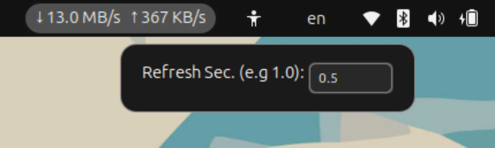

Net Speed Custom
=========

Show current net speed on Ubuntu panel menu.
Customizable display refresh speed within the range of _`0.1`_ to _`60`_ seconds.



--------------------------------

This extension is forked and inspired by <https://github.com/AlynxZhou/gnome-shell-extension-net-speed>.

It only shows text like `↓ 777 KB/s ↑ 2.13 MB/s` on the right side of panel menu with a customizable refresh seconds input.

# Usage

```
$ git clone git@github.com:cengiz7/gnome-shell-extension-net-speed-custom.git ~/.local/share/gnome-shell/extensions/netspeed-custom@cengiz7

Then you need to Log out and Log in to your Ubuntu session!. Alternatively you can press Alt+F2 and then type "r" without the commas. This will reload the extension list

Check if the extension successfully installed by checking the list.
$ gnome-extensions list

Enable the extension:
$ gnome-extensions enable netspeed-custom@cengiz7

To Disable the extension:
$ gnome-extensions disable netspeed-custom@cengiz7

To Uninstall the extension:
$ gnome-extensions uninstall netspeed-custom@cengiz7
```

Then restart GNOME Shell and enable Net Speed from GNOME Extensions.
